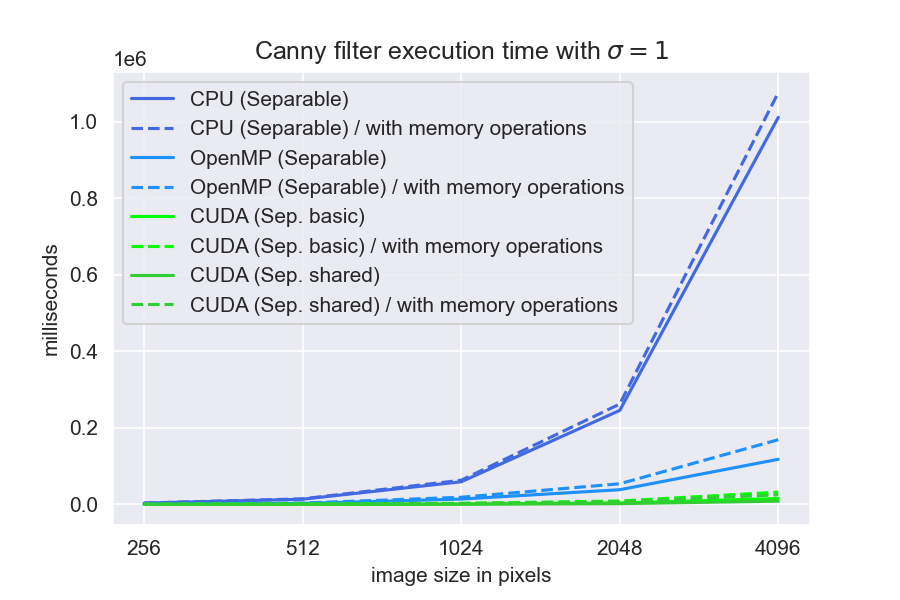
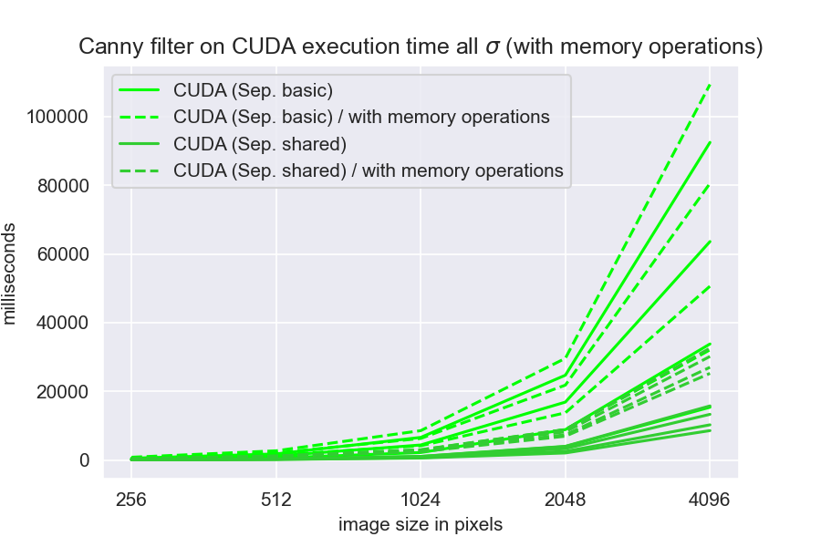

# Canny filter implementation in C++/CUDA.

The code is largely based on the ideas from  
Lourenco L. H. A., Weingaertner D., Todt E. Efficient implementation of canny edge detection filter for ITK using CUDA // 2012 13th Symposium on Computer Systems. – IEEE, 2012. – pp. 33-40.

Convolutions are based on the following:  
Podlozhnyuk V. "Image convolution with CUDA" // NVIDIA Corporation white paper, June. – 2007.

### Optimizations
1. Use of separable convolutions
2. Shared memory
3. Avoiding of warp diversions by replacing ifs with serial code (sadly did not always yield speedups)

### Building and running
To build the app run the following commands from command line
```bash
mkdir build
cd build
cmake ..
make
```
NOTE: you have to manually set the nvcc compiler in CMakeLists.txt  
`set(CMAKE_CUDA_COMPILER /usr/local/cuda-11.6/bin/nvcc)`

Two executables will be created: `openmp` for a cpu implementation and `cuda` for gpu version

Running the app:
```
Canny Filter Application usage: ./openmp sigma thr_high thr_low input_image output_image [num_runs]

Filter options:
  sigma         Gaussian filter sigma value, must be a positive float
  thr_high      High threshold of Canny filter, must be a positive float
  thr_low       Low threshold of Canny filter

  num_runs      (optional) number of runs for benchmarking
  
Help:
  -h            Show this text
```

### Speed comparison
A small python script in `wrapper.py` launches the filter in three modes: single-threaded, all cores using OpenMP and CUDA.  
And displays the running times of the executables.

Usage example:
```bash
python3 wrapper.py ./build/openmp ./build/cuda 3 10 1 input_image.png output_image.png 10
```
Sample output:
```asm
Single threaded process took 599594 milliseconds on average
OpenMP process took 87631 milliseconds on average
CUDA process took 5007 milliseconds (without memory access time) on average
CUDA process took 21532 milliseconds (with memory access time) on average
CUDA process copying time took 16525 milliseconds on average
```

### Requirements
The code was tested using Ubuntu 18.04 with CUDA 11.6  
On a computer with AMD Ryzen 7 3700X CPU and NVIDIA GeForce GTX 1080 GPU


### Speed comparison
In detail execution speeds can be found here:  
https://docs.google.com/spreadsheets/d/1L_StnTh1W5EVb2yYSLtlp9HBL7agRIX31-QqCubktcM/edit?usp=sharing

The following graph and a few other can be found in the `speed_plots` folder
 